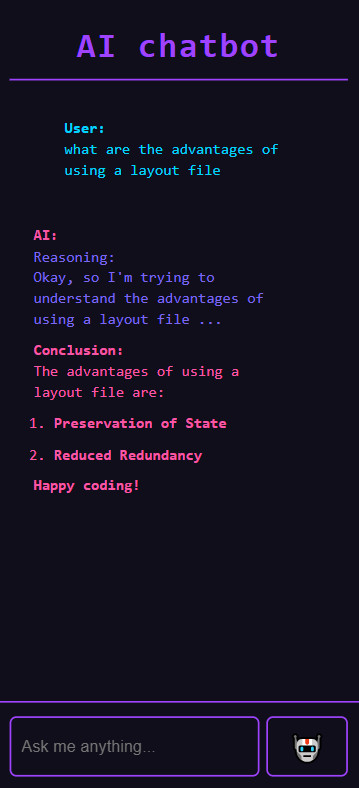

<a href="https://chris.lu/web_development/tutorials/js-deepseek-r1-local-rag">
  <picture>
    <source media="(prefers-color-scheme: dark)" srcset="https://raw.githubusercontent.com/chrisweb/js-deepseek-r1-local-rag/main/public/images/readme/local-javascript-ai-rag_chris-dot-lu.avif" type="image/avif" />
    <source media="(prefers-color-scheme: dark)" srcset="https://raw.githubusercontent.com/chrisweb/js-deepseek-r1-local-rag/main/public/images/readme/local-javascript-ai-rag_chris-dot-lu.webp" type="image/webp" />
    <source media="(prefers-color-scheme: light)" srcset="https://raw.githubusercontent.com/chrisweb/js-deepseek-r1-local-rag/main/public/images/readme/local-javascript-ai-rag_chris-dot-lu.avif" type="image/avif" />
    <source media="(prefers-color-scheme: light)" srcset="https://raw.githubusercontent.com/chrisweb/js-deepseek-r1-local-rag/main/public/images/readme/local-javascript-ai-rag_chris-dot-lu.webp" type="image/webp" />
    
  </picture>
</a>

[](LICENSE.md)

# chris.lu tutorial: Local DeepSeek-R1 AI RAG using JavaScript (TypeScript)

This repository contains all the source code for the [Local DeepSeek-R1 AI RAG using JavaScript (TypeScript)](https://chris.lu/web_development/tutorials/js-deepseek-r1-local-rag) tutorial on my blog (chris.lu)

## Getting started

First clone this repository:

```bash
   git clone https://github.com/chrisweb/js-deepseek-r1-local-rag.git
   cd js-deepseek-r1-local-rag
```

I recommend reading the [tutorial](https://chris.lu/web_development/tutorials/js-deepseek-r1-local-rag) first and then follow these steps:

* use the `npm i` command to install all the dependencies
* make sure you followed the instructions for the [local copy of an ai model](https://chris.lu/web_development/tutorials/js-deepseek-r1-local-rag#enabling-pgvector-for-a-database#ollama-installation)
* put some markdown (or MDX) documents into the **/docs** folder, or download the docs like the [Next.js app router docs](https://github.com/vercel/next.js/tree/canary/docs/01-app), or the [Node.js API docs](https://github.com/nodejs/node/tree/main/doc/api) or the [React.dev docs](https://github.com/reactjs/react.dev/tree/main/src/content/reference/react)
* make sure you followed the steps to [create the database](https://chris.lu/web_development/tutorials/js-deepseek-r1-local-rag#enabling-pgvector-for-a-database)
* run the embeddings script using the `npm run embeddings` command
* use pgAdmin to verify that the database got populated, query `SELECT * FROM vectors`
* use the `npm run dev` command to start a local Next.js development server
* visit **localhost:3000** in your browser to test the chatbot

If everything goes well 🤞 you should have a chat bot like this:



## npm commands (package.json scripts)

`npm run dev`: to start the development server (with turbopack)  
`npm run build`: to make a production build  
`npm run start`: to start the server on a production server using the build we made with the previous command  
`npm run lint`: to lint our code  
`npm run embeddings`: to run the embeddings script that will scan the docs folder, create embeddings and then save them in our vector database
